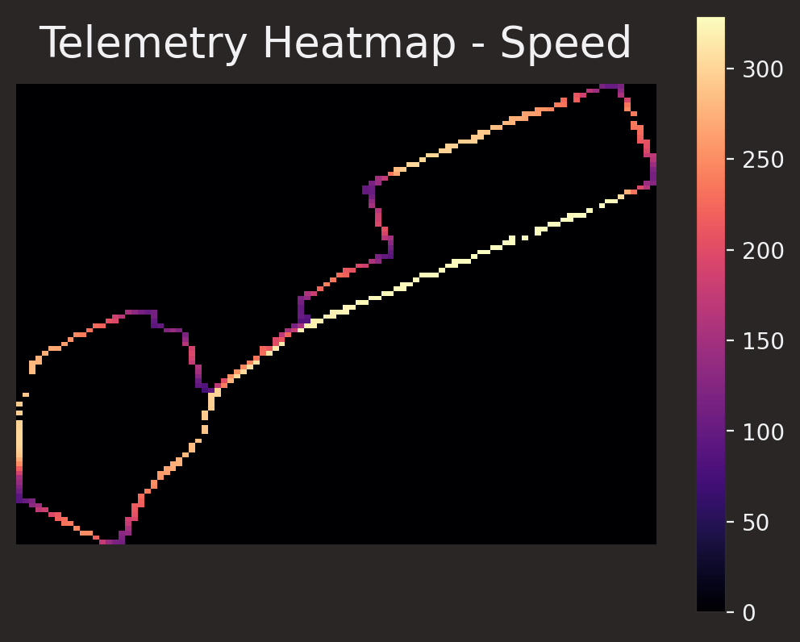
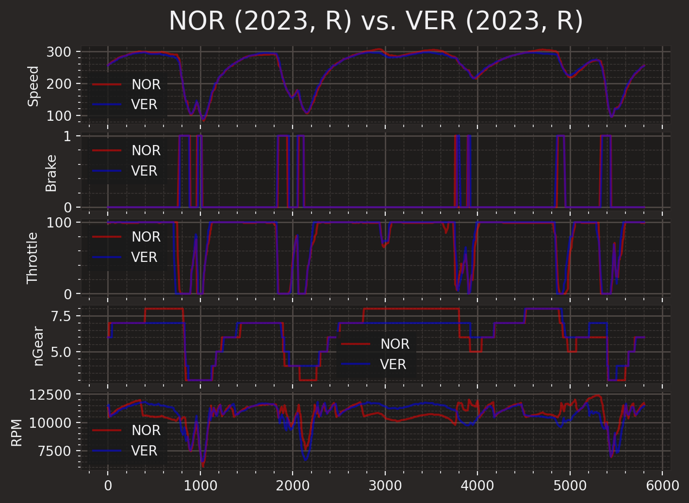

# 🏎️ Rhythm of the Race 🏎️

**Rhythm of the Race** was created to get a deeper, more technical understanding of the intracacies of Formula 1. While watching a Formula 1 race is undeniably thrilling, we often overlook the fascinating details that contribute to the performance and dynamics of these high-speed machines.

# Purpose

The primary goal of Rhythm of the Race is to unlock the hidden insights of Formula 1 by visualizing telemetry data. Through exploring various aspects such as driver habits, race trends, and car performance, Rhythm of the Race aims to enhance the viewers' experience and appreciation of the sport.

# Key Features

- **Telemetry Heatmaps:** A quick, qualitative visualization of where drivers are fastest.

- **Driver Comparison:** A deep dive into the differences of two drivers across a lap; who brakes later? Who is earlier on the throttle? How is his car holding up? Data includes speed, brake application, throttle application, gears and gear shifts, and engine RPM. 

- **Live Tracking:** Live tracking during race watch parties allows users to view real-time telemetry data and follow the action closely. Features are the same as the above driver comparison, but available live during events.

- **Around the World:** F1's calendar takes it all across the globe. How efficient is the race calendar? Explore more [below](#around-the-world).

# Around the World

F1's calendar takes a globetrotting journey across the world. With 23 scheduled races in the 2023 F1 season spanning five continents, the travel involved is nothing short of extraordinary. However, this extensive travel comes with its challenges, including long and arduous journeys, high levels of emissions, and the inevitable jetlag experienced by drivers and team members.

In this section, we explore the concept of optimizing the F1 race calendar from a travel perspective, inspired by the famous ["Traveling Salesperson Problem" (TSP)](https://en.wikipedia.org/wiki/Travelling_salesman_problem). While this is purely an intellectual exercise and not reflective of practical considerations in F1 scheduling, it allows us to delve into the art of optimizing travel distances between races.

<iframe src="https://www.google.com/maps/d/embed?mid=1TYZus2MjA8bVYEiOhnwH3l5G3dA4HoD-&ehbc=2E312F" width="640" height="480"></iframe>

Let's first take a look at locations of the current races. 

| Race # | City          | Country        |
|-------:|--------------:|---------------:|
|      1 | Sakhir        | Bahrain        |
|      2 | Jeddah        | Saudi Arabia   |
|      3 | Melbourne     | Australia      |
|      4 | Baku          | Azerbaijan     |
|      5 | Miami         | United States  |
|      6 | Imola         | Italy          |
|      7 | Monte Carlo   | Monaco         |
|      8 | Barcelona     | Spain          |
|      9 | Montreal      | Canada         |
|     10 | Spielberg     | Austria        |
|     11 | Silverstone   | United Kingdom |
|     12 | Budapest      | Hungary        |
|     13 | Spa-Francorchamps | Belgium    |
|     14 | Zandvoort     | Netherlands    |
|     15 | Monza         | Italy          |
|     16 | Marina Bay    | Singapore      |
|     17 | Suzuka        | Japan          |
|     18 | Losail        | Qatar          |
|     19 | Austin        | United States  |
|     20 | Mexico City   | Mexico         |
|     21 | Sao Paulo     | Brazil         |
|     22 | Las Vegas     | United States  |
|     23 | Yas Island    | United Arab Emirates |

F1's original 2023 calendar [takes](src/aroundtheworld.py) a whopping **82,458 miles** (note that a non-precise radius of the earth was used, and the latitude and longtiude for each race location was rounded; we also assume that travel can occur in straight lines along the surface of the earth. Furthermore, we must travel from race 23 to race 1 for the sake of starting the next season). 

Now let's dive into optimizing the race calendar.

|New Race # | Original Race # | City          | Country        |
|----------:|-------:|--------------:|---------------:|
|          1|      1 | Sakhir        | Bahrain        |
|          2|      2 | Jeddah        | Saudi Arabia   |
|          3|     12 | Budapest      | Hungary        |
|          4|     10 | Spielberg     | Austria        |
|          5|      6 | Imola         | Italy          |
|          6|     15 | Monza         | Italy          |
|          7|      7 | Monte Carlo   | Monaco         |
|          8|      8 | Barcelona     | Spain          |
|          9|     13 | Spa-Francorchamps | Belgium    |
|         10|     14 | Zandvoort     | Netherlands    |
|         11|     11 | Silverstone   | United Kingdom |
|         12|      9 | Montreal      | Canada         |
|         13|     22 | Las Vegas     | United States  |
|         14|     19 | Austin        | United States  |
|         15|     20 | Mexico City   | Mexico         |
|         16|      5 | Miami         | United States  |
|         17|     21 | Sao Paulo     | Brazil         |
|         18|      3 | Melbourne     | Australia      |
|         19|     16 | Marina Bay    | Singapore      |
|         20|     17 | Suzuka        | Japan          |
|         21|      4 | Baku          | Azerbaijan     |
|         22|     23 | Yas Island    | United Arab Emirates |
|         23|     18 | Losail        | Qatar          |

By optimizing the race calendar using the [Traveling Salesperson Problem approach](src/aroundtheworld.cpp), we have managed to reduce the total travel distance to **38,545 miles**, a reduction of **53.2%**.

Many improvements are immediately obvious. Races that were previously scattered have now been grouped more efficiently, allowing for regional visits. For example, the Miami race in the initial calendar was awkwardly placed between trips to MENA and Europe. 

In general, there are now clear regional groupings. Near the start/end, we see the MENA region visited; then we head to a trip around Europe, the Americas (launching from the UK and landing in Canada–minimizing travel here too), and then to Australia and Asia. 

It is important to note that while the optimization process has provided valuable insights, the original Formula 1 calendar already exhibits a remarkable level of thoughtfulness and planning (with the exception of a few sore thumbs like Melbourne, Baku, Miami, and Montreal; all of these races interestingly fall in the first 10 races). The optimized calendar roughly follows a sketch of the original calendar, though reordering a couple of races for maximal efficiency. Overall, F1 has done a remarkable job in scheduling considering challenges like weather and logistical difficulties that they face when deciding the calendar.

Ultimately, Formula 1 continues to captivate audiences worldwide with its blend of adventure, precision, and wonder. The optimization study, along with the entire project, aims to offer a glimpse into the intricate world of Formula 1 logistics while celebrating the spectacle and excitement that the sport brings to fans around the globe.

# How to Use

To experience **Rhythm of the Race**, follow these simple steps:

1. Install the necessary dependencies from [here](src/requirements.txt).
2. Launch the application using Flask and select the desired race, session, and drivers for comparison.
3. Explore the various visualization options to understand driver habits, race trends, and car performance.
4. Engage in live tracking during race watch parties and share the excitement with fellow fans.